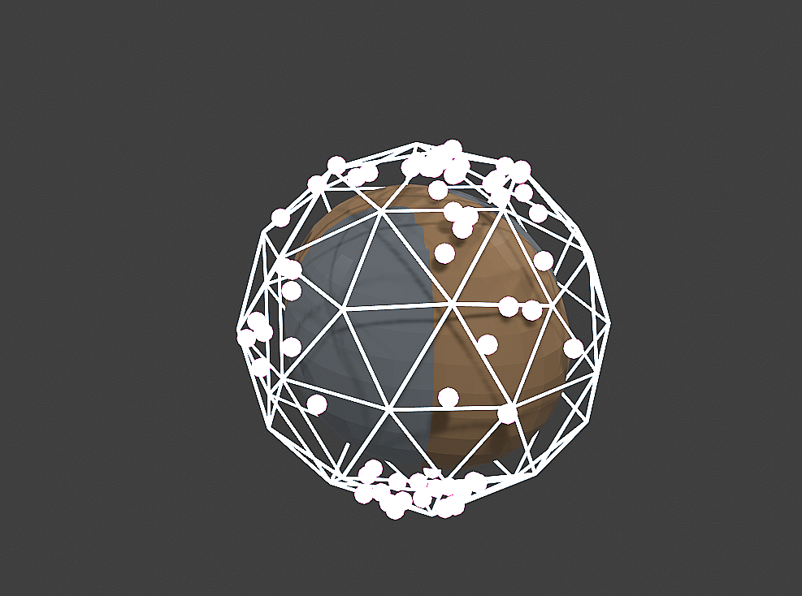

# **Simulation Suite – Flyxion Plenum Experiments (v1 → v3.3)**



## **Overview**

This repository contains Blender-based generative simulations designed to visualize, test, and explore the geometric and field-theoretic structures underlying **RSVP theory**, **TARTAN**, **HYDRA**, **Semantic Merge Operators**, **Xylomorphic Architecture**, and related frameworks in the Flyxion ecosystem.

Early versions (v1–v2) established prototype directories and stub modules but **do not produce meaningful geometry**.
The **v3+ simulation architecture is the first complete, functional, and fully generative release**, producing detailed visual objects, still-frame renders, and `.blend` scene files for manual exploration.

All functional simulations live inside:

```
sim_v3_release/
sim_v3_1_release/
sim_v3_2_release/
sim_v3_3_release/   ← (most recent)
```

Each version introduces more sophisticated geometry, materials, symbolic structures, and theoretical fidelity.

---

# **Running the Simulations**

Each v3.x folder contains:

```
v3_x/
  scripts/      ← individual generative geometry modules
  helpers/      ← scene, camera, material, and render setup
  output_v3_x/  ← .blend files and rendered stills
  logs_v3_x/    ← Blender logs
  render_stills_v3_x.sh  ← batch runner (static stills only)
```

To render all objects:

```bash
cd sim_v3_3_release/v3_3
chmod +x render_stills_v3_3.sh
./render_stills_v3_3.sh
```

---

# **Conceptual Overview of v3.3 Experiments**

Below is a breakdown of each object and what aspect of the theory it represents.

---

## **1. RSVP Hypercell**

**Files:** `rsvp_hypercell.py`, `rsvp_hypercell.png`

This is the “atom” of the Relativistic Scalar-Vector Plenum.

**Symbolism:**

* **Φ Core:** Scalar density or potential well of the plenum.
* **Vector Shell:** Anisotropic deformation representing local flows (𝒗).
* **Coherence Shell:** A smooth semantic equilibrium boundary.
* **Entropy Sparks:** Fluctuations and micro-instabilities propagating outwards.
* **Constraint Cage:** Torsion and curvature constraints binding the local region.

Represents *a minimal unit of conscious computation in geometric form.*

---

## **2. TARTAN Recursive Tile**

**Files:** `tartan_recursive_tile.py`

A fractally-structured semantic cube reflecting TARTAN’s recursive tiling dynamics.

**Symbolism:**

* **Face Tiles:** Local patches of inference or scalar/vector coupling.
* **Corner Nodes:** High-density semantic knots (trajectory memory).
* **Recursive Pattern:** Multiscale scene decomposition and reassembly.

This is the 3D analog of a TARTAN “step” in trajectory-aware inference.

---

## **3. Semantic Operator Orbit**

**Files:** `semantic_operator_orbit.py`

Represents fundamental operators in the monoidal ∞-category of semantic modules.

**Symbolism:**

* **Core:** Neutral reference frame for meaning.
* **⊕ (Merge):** Composition of semantic flows.
* **⊗ (Tensor):** Structural lift / joint reasoning modes.
* **⇒ (Implication):** Directional inference or constraint propagation.
* **μ (Sheaf Glue):** Local-to-global coherence.

This is a geometric analogue to compositional semantics.

---

## **4. HYDRA Persona Dyad**

**Files:** `hydra_persona_dyad.py`

Two HYDRA personas interacting across a semantic bond.

**Symbolism:**

* **Glyphs:** Stable persona attractors.
* **Bond Ribbon:** Interaction path / inference bridge.
* **Entropic Cloud:** Shared uncertainty or cognitive blending.

Represents cooperative agent dynamics or internal subsystem negotiation.

---

## **5. Xylomorphic Root-Brain**

**Files:** `xylomorphic_root_brain.py`

A hybrid between forest architecture and neural structure.

**Symbolism:**

* **Spine:** Central energetic backbone of a system.
* **Mycelial Tubes:** Distributed intelligence channels.
* **Neurons:** Canopy-level integration nodes.
* **Bridges:** Cross-talk of independent layers.

Captures the idea of cities, organs, or ecosystems as coherent processing systems.

---

# **Advanced / Optional Experiments (v3.3)**

### **6. Entropic Vortex Coil**

**Represents:** lamphrodynamic rotation, attractor wells, and self-organization.

### **7. Categorical Pushout Sculpture**

**Represents:** pushouts as “unification events” between semantic modules.

### **8. RSVP Field Sheet**

**Represents:** Φ(x,y) scalar surface with emergent curvature.

### **9. Cognitive Phase Portrait**

**Represents:** attractor basins of cognition and simulated agency dynamics.

### **10. HYDRA Crown**

**Represents:** four-persona integration into a coherent meta-agent.

---

# **Version Notes**

| Version         | Description                                                                       |
| --------------- | --------------------------------------------------------------------------------- |
| **v1**          | Placeholder scripts; no usable geometry.                                          |
| **v2**          | More structure, but still incomplete. Produces flat planes / placeholder outputs. |
| **v3.0 – v3.2** | First functional geometric objects; useful but partial.                           |
| **v3.3**        | **Recommended version** – fully operational, symbolic geometry, high fidelity.    |

---

# **Philosophical Context**

These simulations are not merely graphics—they serve as **geometric experiments** for:

* recursive causality
* semantic merge structures
* entropy flows and lamphrodynamics
* plenum field topology
* agentic decomposition and recombination
* structural cognition in RSVP

